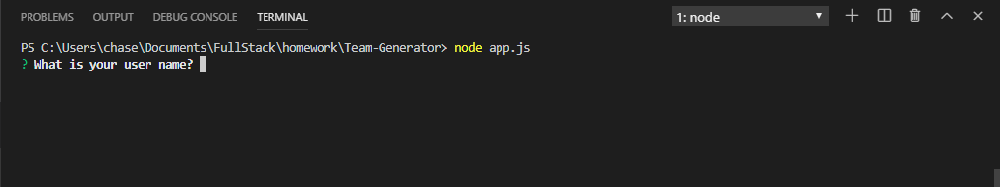
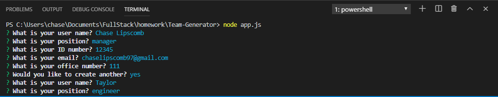
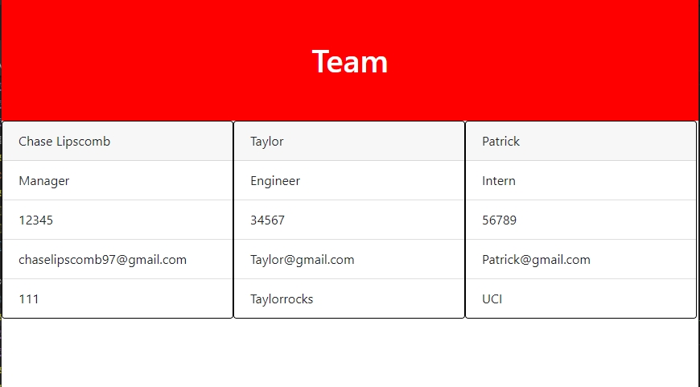

# Team-Generator
This Team Generator allows a user to input data about multiple people and outputs each person onto a card to view. Each profile can be either a Manager, Engineer, or Intern and will have one uniquie property based on their position.
After inputting node app.js into the terminal, the user will be guided through questions and when finished, the result will be displayed in the browser.

Step 1: Enter the data

Step 2: View Data

Step 3: Open in browser to see result
